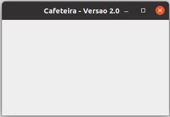

# Cafeteira
O Cafeteira é um pequeno RAD (Rapid Aplication Developer), totalmente feito em Java, que permite a geração de Janelas (padrão Swing) para suas aplicações com as mesmas facilidades do Delphi©, sendo extremamente leve e pequeno o suficiente para caber em um simples disquete.

## Manual de Uso

Para sua execução é necessário ter o Java instalado (versão JRE). 

Execução:
```
java -jar cafeteira.jar
```

 

Assim que for iniciado, será mostrado uma janela com minha pequena xícara de café, aguarde e esta será fechada mostrando uma janela vazia. Esta nova janela agora em branco é como ficará a sua janela final, clique com o botão direito do mouse e você terá acesso as opções:

* Legenda: permite que seja trocado o título da janela.
* Cor da Janela: permite que uma nova cor de fundo seja definida.
* Formato da Janela: Permite escolher entre os formatos modal é uma janela que não pode ser alternada com outra ou redimensionável o usuário não poderá alterar o tamanho da janela.
* Criar Objetos: Uma barra com todos os objetos descritos acima serão mostrados, clique no objeto desejado e na mira que se formar o cursor clique na posição dele na janela. Ao ser clicado no objeto com o botão direito pode-se removê-lo ou alterar suas propriedades e marcar determinados eventos.
* Geração: Informe o nome da classe e o nome do pacote (se não quiser definir um pacote apenas deixe em branco), será mostrado os códigos em Java para a criação da janela, basta copiá-los para o editor de sua preferência, depois é brincar de “bricolagem” colando os códigos dos objetos em 3 blocos.
* Abrir: Permite abrir um projeto salvo no formato do cafeteira (formato .CAF)
* Salvar: Permite salvar um projeto do cafeteira (formato .CAF)
* Limpar: Elimina todos os objetos da janela (sempre faça isso antes de abrir um projeto)

Este é um software extremamente simples, temos uma simples janela que pode ser inseridos uma relação dos seguintes objetos:

 

JLabel 	
JTextField 	
JPasswordField 	
JButton
JList 	
JTextArea 	
JRadioButton 	
JCheckBox 	
JComboBox

Clicar com o botão direito do mouse em cima do objeto e temos o menu deste com as opções:
* Propriedades: que permite definir algumas propriedades dos objetos e eventos para estes. Na janela de propriedades existe uma combobox que permite a seleção de qualquer outro objeto.
* Excluir: eliminar o objeto.
 
Uma vez pronta sua janela vem a parte difícil, gerar (recomendo que antes de realizar este processo salve a janela). A tela de geração está dividida em 2 partes: Classe e Objetos. Abra seu editor favorito e cole a classe após isso é só localizar a indicação aonde os blocos de 1 a 3 devem ser colocados. E está pronto!

## Software em Sustentação:

**Versão 2.0:**

* Implementação de muitas funcionalidades que desejava inserir.
* Melhoria total da última versão disponível do Cafeteira a 12 anos atrás. 

**Versões Anteriores:**

* Estão descritas no "Diário do Cafeteira" que pode ser acessado na pasta DOCs.
* Versão 1.02 em Delphi ainda existe e está disponível na pasta Doc.
